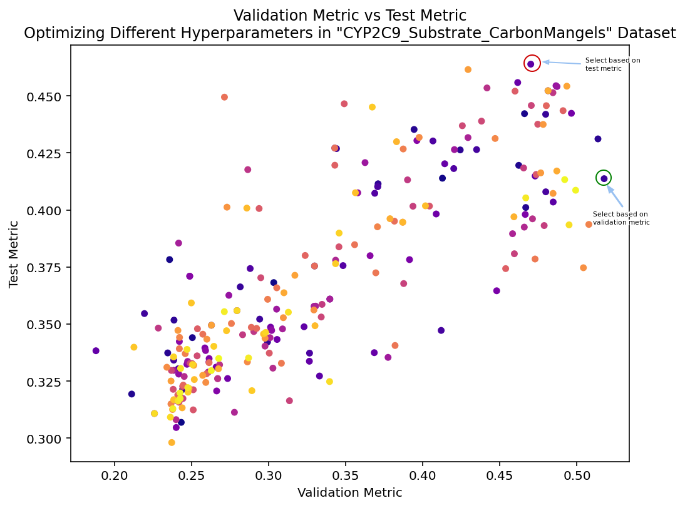

<a id="readme-top"></a>

# Molecular Property Prediction

This section of the repository contains all necessary scripts and details for fine-tuning ChemFM for **Molecular Property Prediction** tasks.

We provide <a href="https://huggingface.co/spaces/ChemFM/molecular_property_prediction"> Hugging Face demos</a> 
where you can run property prediction on the benchmark datasets.

## Overview

Molecular property prediction is one of the key tasks in computational chemistry, where the goal is to predict various properties (e.g., solubility, bioactivity, toxicity) of a molecule based on its SMILES representation.

- We include **comparisons for the benchmark datasets** (MoleculeNet and ADMET), along with details to replicate the results reported in the paper. 
Model checkpoints and configurations are also provided for each dataset.

- We also provide **code for fine-tuning on custom datasets**, allowing flexibility for various tasks.

## Steps to Fine-tune ChemFM
<details>
  <summary> <strong><font size="+1"> 1. Prepare the Dataset </font></strong> </summary>

#### 1.1 MoleculeNet

For MoleculeNet datasets, we use [ChemBench](https://github.com/shenwanxiang/ChemBench), which extracts the exact same datasets (including splitting methods, random seed, and number of folds) as described in the [MoleculeNet paper](https://pubs.rsc.org/en/content/articlelanding/2018/sc/c7sc02664a).

To install ChemBench, use the following commands:

```bash
git clone https://github.com/shenwanxiang/ChemBench.git
cd ChemBench
pip install -e .
```

#### 1.2 ADMET

For the ADMET benchmark, we use the [TDC](https://tdcommons.ai/) (Therapeutics Data Commons) library, which is included in the [`environment.yml`](../../environment.yml) file provided in the main page. Alternatively, you can install it using the following command:

```bash
conda install -c conda-forge pytdc
```

#### 1.3 CustomDataset

To fine-tune ChemFM on a custom dataset, you need to prepare your dataset in a folder with three CSV files: `train.csv`, `val.csv`, and `test.csv`. Each CSV file should include:
- A **"smiles"** column for the molecular SMILES strings.
- One or more label columns for the target property values.
For reference, example files are provided in the [`custom_data_example`](./custom_data_example/) folder.

You can refer to the [Supported Features](#supported-features) section to learn more about the types of tasks we support.

</details>

<p align="right">(<a href="#readme-top">back to top</a>)</p>


<details>
  <summary> <strong><font size="+1"> 2. Configure the Parameters for Training </font></strong></summary>

You can configure the parameters for training in two ways:

- **Feed arguments directly to the Python file**: Pass the arguments as command-line parameters when running the training script.
- **Specify the parameters in a YAML file**: Define all configurations in a `.yml` file and pass the file path to the Python script.

We provide an [example YAML file](./configs/example.yml) along with explanations of the configuration options.

For the MoleculeNet and ADMET benchmark datasets, you can directly use the configuration files stored in [`configs/admet`](./configs/admet/) and [`configs/moleculenet`](./configs/moleculenet/).
</details>

<p align="right">(<a href="#readme-top">back to top</a>)</p>

<details>
<summary> <strong><font size="+1"> 3. Fine-tuning Script </font></strong></summary>

To fine-tune ChemFM, you can use the following command:

```bash
python -m accelerate.commands.launch --config_file accelerate_config.yaml main.py --training_args_file <config_yml_file>
```
Our code is based on the [accelerate](https://huggingface.co/docs/accelerate/main/en/index) package, and the [accelerate_config.yaml](./accelerate_config.yaml) file is used to configure the distribution settings for training across multiple devices.

</details>

<p align="right">(<a href="#readme-top">back to top</a>)</p>

## Benchmark Results

The evaluation of molecular property prediction models can be quite noisy in the community. We have observed several papers and methods that use certain *"tricks"*  to improve their evaluation performance. 
Our evaluations, however, are based on the following strict standards, which are common in machine learning evaluations but often ignored by some methods:

- **Exact dataset usage**: We use the exact same datasets (including the splitting methods, random seeds, and number of folds). 
This ensures that the training, validation, and test datasets are consistent across evaluations. 
Different data splits can lead to significant differences in evaluation results, especially when using the scaffold splitting.

- **Training only on the training set**: We strictly use only the training data for training the model. 
Including validation data in the training set can considerably boost performance, especially for datasets with fewer than 1000 data samples.

- **Hyperparameter tuning on the validation set**: 
We tune hyperparameters only based on the *validation dataset*, not the *test dataset*. 
Public test datasets are often leaked, and we’ve observed cases where hyperparameters are optimized directly on test performance, which are not correctly evaluated. 
 For example, when working with the CYP2C9_Substrate_CarbonMangels dataset in the ADMET benchmark, we select hyperparameters and report the performance based on the validation metric (the dot in the green circle) rather than using the test metric (the dot in the red circle).
<p align="center">
  
</p>

<p align="right">(<a href="#readme-top">back to top</a>)</p>


### MoleculeNet Results
<details>
  <summary>Click to expand the MoleculeNet results</summary>

| **Category**            | **Dataset**     | **Task Metric**  | **MoleculeNet (Model)** | **Chemprop** | **MMNB** | **ChemFM-3B**             |
|-------------------------|-----------------|------------------|---------------------------|----------------|----------------|-----------------------------|
| **Pharmacokinetic**      | BBBP            | ROC-AUC ↑        | 0.690 (Weave)             | 0.738          | _0.739_        | **0.751**                   |
| **Bioactivity**          | BACE            | ROC-AUC ↑        | 0.806 (Weave)             | -              | _0.835_        | **0.869**                   |
|                         | HIV             | ROC-AUC ↑        | 0.763 (GC)                | 0.776          | _0.777_        | **0.807**                   |
|                         | MUV             | PRC-AUC ↑        | _0.109_ (Weave)           | 0.041          | 0.096          | **0.135**                   |
|                         | PCBA            | PRC-AUC ↑        | 0.136 (GC)                | _0.335_        | 0.276          | **0.346**                   |
| **Toxicity**             | Tox21           | ROC-AUC ↑        | 0.829 (GC)                | _0.851_        | 0.845          | **0.869**                   |
|                         | SIDER           | ROC-AUC ↑        | 0.638 (GC)                | 0.676          | _0.680_        | **0.709**                   |
|                         | ClinTox         | ROC-AUC ↑        | 0.832 (Weave)             | 0.864          | _0.888_        | **0.918**                   |
| **Physicochemical**      | ESOL            | RMSE ↓           | 0.580 (MPNN)              | _0.555_        | 0.575          | **0.516**                   |
|                         | FreeSolv        | RMSE ↓           | 1.150 (MPNN)              | _1.075_        | 1.155          | **0.830**                   |
|                         | Lipophilicity   | RMSE ↓           | 0.655 (GC)                | _0.555_        | 0.625          | **0.545**                   |
| **Molecular Binding**    | PDBbind-Full    | RMSE ↓           | 1.440 (GC)                | 1.391          | _0.721_        | **0.697**                   |

</details>
<p align="right">(<a href="#readme-top">back to top</a>)</p>


### ADMET Results
If you want to evaluate or submit the results, you can download the trained [model checkpoints](https://clemson.box.com/s/9t6399l8fk4n1uvkvhubssmtldwmrzbb) for each dataset. Then, simply run the following command:

```bash
python ./submit_admet.py --model_path <path to the checkpoints> --dataset <dataset_name> --task_type <regression or classification>
```

We carefully reviewed the published code and excluded certain methods from comparison in the ADMET benchmark because they did not follow the evaluation rules outlined above. 
The reasons for excluding these methods are detailed in Table S2.5 of the paper.

<details>
  <summary>Click to expand the ADMET results</summary>

| **Category**     | **Dataset**             | **Task Metric**  | **Previous Best**                       | **ChemFM**                  |
|------------------|-------------------------|------------------|-----------------------------------------|-----------------------------|
| **Absorption**    | Caco2_Wang              | MAE ↓            | 0.330 ± 0.024 @Chemprop-RDKit           | **0.322** ± 0.026           |
|                  | Bioavailability_Ma      | ROC-AUC ↑        | 0.672 ± 0.021 @DeepPurpose              | **0.715** ± 0.011           |
|                  | Lipophilicity_AstraZeneca| MAE ↓            | 0.467 ± 0.006 @Chemprop-RDKit           | **0.460** ± 0.006           |
|                  | Solubility_AqSolDB      | MAE ↓            | 0.761 ± 0.025 @Chemprop-RDKit           | **0.725** ± 0.011           |
|                  | HIA_Hou                 | ROC-AUC ↑        | 0.981 ± 0.002 @Chemprop-RDKit           | **0.984** ± 0.004           |
|                  | Pgp_Broccatelli         | ROC-AUC ↑        | 0.929 ± 0.006 @AttrMasking              | **0.931** ± 0.003           |
| **Distribution**  | BBB_Martins             | ROC-AUC ↑        | 0.897 ± 0.004 @ContextPred              | **0.908** ± 0.010           |
|                  | PPBR_AZ                 | MAE ↓            | 7.788 ± 0.210 @Chemprop                 | **7.505** ± 0.073           |
|                  | VDss_Lombardo           | Spearman ↑       | 0.561 ± 0.025 @DeepPurpose              | **0.662** ± 0.013           |
| **Metabolism**    | CYP2C9_Veith            | PRC-AUC ↑        | 0.777 ± 0.003 @Chemprop-RDKit           | **0.788** ± 0.005           |
|                  | CYP2D6_Veith            | PRC-AUC ↑        | 0.673 ± 0.007 @Chemprop-RDKit           | **0.704** ± 0.003           |
|                  | CYP3A4_Veith            | PRC-AUC ↑        | 0.876 ± 0.003 @Chemprop-RDKit           | **0.878** ± 0.003           |
|                  | CYP2C9_Substrate_CarbonMangels| PRC-AUC ↑  | 0.400 ± 0.008 @Chemprop-RDKit           | **0.414** ± 0.027           |
|                  | CYP2D6_Substrate_CarbonMangels| PRC-AUC ↑  | 0.686 ± 0.031 @Chemprop-RDKit           | **0.739** ± 0.024           |
|                  | CYP3A4_Substrate_CarbonMangels| ROC-AUC ↑  | 0.619 ± 0.030 @Chemprop-RDKit           | **0.654** ± 0.022           |
| **Excretion**     | Half_Life_Obach         | Spearman ↑       | 0.329 ± 0.083 @DeepPurpose              | **0.551** ± 0.020           |
|                  | Clearance_Hepatocyte_AZ  | Spearman ↑       | 0.439 ± 0.026 @ContextPred              | **0.495** ± 0.030           |
|                  | Clearance_Microsome_AZ   | Spearman ↑       | 0.599 ± 0.025 @Chemprop-RDKit           | **0.611** ± 0.016           |
| **Toxicity**      | LD50_Zhu                | MAE ↓            | 0.606 ± 0.024 @Chemprop                 | **0.541** ± 0.015           |
|                  | hERG                    | ROC-AUC ↑        | 0.841 ± 0.020 @DeepPurpose              | **0.848** ± 0.009           |
|                  | AMES                    | ROC-AUC ↑        | 0.850 ± 0.004 @Chemprop-RDKit           | **0.854** ± 0.007           |
|                  | DILI                    | ROC-AUC ↑        | 0.919 ± 0.008 @ContextPred              | **0.920** ± 0.012           |

</details>
<p align="right">(<a href="#readme-top">back to top</a>)</p>

## Supported Features

The provided code examples demonstrate how to fine-tune ChemFM, and currently, the code only supports the following fine-tuning techniques and tasks, with more options to be tested and extended.

You are welcome to customize the output head and loss function to adapt to other types of tasks.

Fine-tuning Techniques
- [x] **LoRA** (Low-Rank Adaptation)
- [ ] **Full-parameters fine-tuning** (need to test)

Supported Tasks
- [x] **Single-label regression and classification** (binary labels)
- [x] **Multi-label classification** (each instance can be assigned to multiple binary labels)
- [ ] **Multi-class classification** (each instance is assigned to one and only one label; the number of labels is greater than 2)
- [ ] **Hybrid classification and regression labels**

<p align="right">(<a href="#readme-top">back to top</a>)</p>