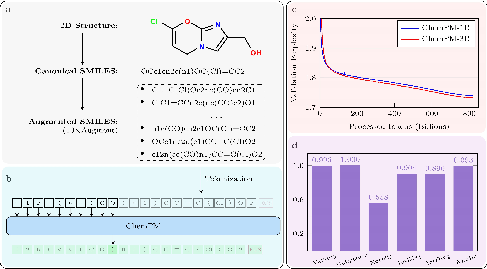
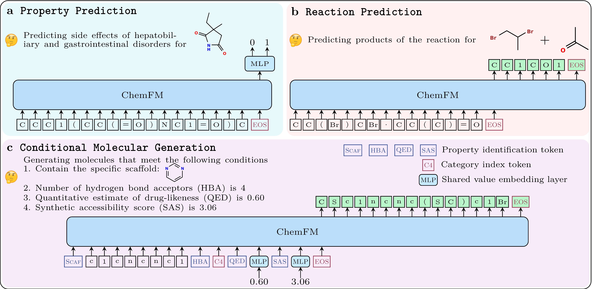

<a id="readme-top"></a>

<!-- PROJECT SHIELDS -->
<!--
*** I'm using markdown "reference style" links for readability.
*** Reference links are enclosed in brackets [ ] instead of parentheses ( ).
*** See the bottom of this document for the declaration of the reference variables
*** for contributors-url, forks-url, etc. This is an optional, concise syntax you may use.
*** https://www.markdownguide.org/basic-syntax/#reference-style-links
-->

[stars-shield]: https://img.shields.io/github/stars/TheLuoFengLab/ChemFM.svg?style=flat-square&color=b75347
[stars-url]: https://github.com/TheLuoFengLab/ChemFM/stargazers
[forks-shield]: https://img.shields.io/github/forks/TheLuoFengLab/ChemFM.svg?style=flat-square&color=df7e66
[forks-url]: https://github.com/TheLuoFengLab/ChemFM/network/members
[issues-shield]: https://img.shields.io/github/issues/TheLuoFengLab/ChemFM.svg?style=flat-square&color=edc775
[issues-url]: https://github.com/TheLuoFengLab/ChemFM/issues
[license-shield]: https://img.shields.io/github/license/TheLuoFengLab/ChemFM.svg?style=flat-square&color=94b594
[license-url]: https://github.com/othneildrew/TheLuoFengLab/ChemFM/blob/master/LICENSE.txt


<!-- PROJECT LOGO -->
<br />
<div align="center">
  <h1 align="center">ChemFM: A Foundation Model for Chemistry</h1>

  [![Stargazers][stars-shield]][stars-url]
  [![Forks][forks-shield]][forks-url]
  [![Issues][issues-shield]][issues-url]
  [![MIT License][license-shield]][license-url]

  <p align="center">
    <a href="https://arxiv.org/abs/2410.21422">
      
    </a>    
    <a href="https://huggingface.co/ChemFM">
      ArXiv
    </a>
    |
    <a href="https://huggingface.co/ChemFM">
      
    </a>    
    <a href="https://huggingface.co/ChemFM">
      Hugging Face
    </a>
    |
    <a href="https://discord.gg/xjyVaZ9V">
      
    </a>    
    <a href="https://discord.gg/xjyVaZ9V">
      Discord
    </a>
  </p>

  <p align="center">
    <a href="https://github.com/TheLuoFengLab/ChemFM/issues/new?labels=bug&template=bug-report---.md">Report Bug</a>
    ·
    <a href="https://github.com/TheLuoFengLab/ChemFM/issues/new?labels=enhancement&template=feature-request---.md">Request Feature</a>
  </p>
</div>


<!-- TABLE OF CONTENTS -->
<details>
  <summary>Table of Contents</summary>
  <ol>
    <li>
      <a href="#about-the-project">About The Project</a>
    </li>
    <li>
      <a href="#getting-started">Getting Started</a>
    </li>
    <li><a href="#usage">Usage</a></li>
    <li><a href="#roadmap">Roadmap</a></li>
    <li><a href="#contributing">Contributing</a></li>
    <li><a href="#contact">Contact</a></li>
    <li><a href="#citation">Citation</a></li>
    <li><a href="#acknowledgments">Acknowledgments</a></li>
    <li><a href="#license">License</a></li>
  </ol>
</details>


<!-- ABOUT THE PROJECT -->
## About The Project
ChemFM is a large-scale foundation model, specifically designed for chemistry. 
It has been [pre-trained](https://github.com/TheLuoFengLab/ChemFM/tree/master/pretraining) on 178 million molecules from [UniChem](https://www.ebi.ac.uk/unichem/) using self-supervised causal language modeling, enabling the extraction of versatile and generalizable molecular representations.

The model comes in two variations with approximately 1 billion and 3 billion trainable parameters:
- ChemFM-1B  &nbsp; [<a href="https://huggingface.co/ChemFM/ChemFM-1B"> Model Page</a>]
- ChemFM-3B &nbsp; [<a href="https://huggingface.co/ChemFM/ChemFM-3B"> Model Page</a>]

<p align="center">
  
</p>

The model can be fine-tuned for a wide range of downstream chemical tasks, such as:
* [Molecular property prediction](./finetuning/property_prediction) &nbsp; [<a href="https://huggingface.co/spaces/ChemFM/molecular_property_prediction"> Demo</a>]
* [Conditional molecular generation](./finetuning/conditional_generation) &nbsp; [<a href="https://huggingface.co/spaces/ChemFM/molecular_conditional_generation"> Demo</a>] (under construction)
* [Reaction synthesis and retro-synthesis predictions](./finetuning/reaction_prediction) &nbsp; [<a href="https://huggingface.co/spaces/ChemFM/reaction_prediction"> Demo</a>] (under construction)
* And more ...

<p align="center">
  
</p>


<p align="right">(<a href="#readme-top">back to top</a>)</p>


<!-- GETTING STARTED -->
## Getting Started
ChemFM has been tested with Python 3.10 and PyTorch 2.3.0. You can easily set up the required environment using Conda by following these steps:

* Clone the repository
  ```bash
  git clone https://github.com/TheLuoFengLab/ChemFM.git
  cd ChemFM
  ```
* Create and activate Conda environment
  ```bash
  conda env create -f environment.yml 
  conda activate ChemFM
  ```
<p align="right">(<a href="#readme-top">back to top</a>)</p>


<!-- USAGE EXAMPLES -->
## Usage

### Quick Start
To get started with ChemFM, you can load the ChemFM models directly from Hugging Face using the following Python script:
```python
from transformers import AutoModel, AutoTokenizer

# Load the ChemFM-3B model and tokenizer
model_name = "ChemFM/ChemFM-3B"
model = AutoModel.from_pretrained(model_name)
tokenizer = AutoTokenizer.from_pretrained(model_name)
```

### Pre-training the Model
Pre-training requires significant time and high-performance GPUs due to the scale of both the model and the dataset. For instance, ChemFM-3B took over 20 days on 16 H100 GPUs.
For detailed instructions on how to pre-train ChemFM, please refer to the [pretraining](https://github.com/TheLuoFengLab/ChemFM/tree/master/pretraining) subfolder.

### Fine-tuning the Model
Fine-tuning can typically be performed on a single moderate GPU machine.
For detailed instructions on how to fine-tune ChemFM for specific tasks, please refer to the relevant subfolders:
* Molecular property prediction: [finetuning/property_prediction](https://github.com/TheLuoFengLab/ChemFM/tree/master/finetuning/property_prediction)
* Conditional molecular generation: [finetuning/conditional_generation](https://github.com/TheLuoFengLab/ChemFM/tree/master/finetuning/conditional_generation)
* Reaction synthesis and retro-synthesis predictions: [finetuning/reaction_prediction](https://github.com/TheLuoFengLab/ChemFM/tree/master/finetuning/reaction_prediction)

<p align="right">(<a href="#readme-top">back to top</a>)</p>


<!-- ROADMAP -->
## Roadmap

This GitHub project is still under active development. Below is the current roadmap:

- [ ] [Pre-training](https://github.com/TheLuoFengLab/ChemFM/tree/master/pretraining)
- [x] [Molecular Property Prediction](https://github.com/TheLuoFengLab/ChemFM/tree/master/finetuning/property_prediction)
- [ ] [Conditional Molecular Generation](https://github.com/TheLuoFengLab/ChemFM/tree/master/finetuning/conditional_generation)
- [ ] [Reaction Prediction](https://github.com/TheLuoFengLab/ChemFM/tree/master/finetuning/reaction_prediction)

If you'd like to request additional features, please [submit a feature request](https://github.com/TheLuoFengLab/ChemFM/issues/new?labels=enhancement&template=feature-request---.md) in the GitHub Issues section, or feel free to [contact us](#contact).

<p align="right">(<a href="#readme-top">back to top</a>)</p>


<!-- CONTRIBUTING -->
## Contributing
Any contributions you make are **greatly appreciated** and can include, but not limited to:
- **New dataset evaluations** for existing tasks.
- **Extensions to new task domains** in chemistry.

If you have suggestions for improvement, feel free to fork the repository and submit a pull request. 
You can also open an issue with the "[enhancement](https://github.com/TheLuoFengLab/ChemFM/issues/new?labels=enhancement&template=feature-request---.md)" tag. 

<p align="right">(<a href="#readme-top">back to top</a>)</p>


<!-- CONTACT -->
## Contact

Main Developer: [Feiyang Cai](mailto:feiyang@clemson.edu) - feiyang@clemson.edu  
Project Supervisor: [Feng Luo](mailto:luofeng@clemson.edu) - luofeng@clemson.edu  

Join our community on [Discord](https://discord.gg/xjyVaZ9V) to stay updated or ask questions.

<p align="right">(<a href="#readme-top">back to top</a>)</p>

## Citation
If you find our work valuable, please consider giving the project a star and citing it in your research:
```
@article{ChemFM,
       author = {Cai, Feiyang and Luo, Feng},
        title = {ChemFM: A foundation model for Chemisty},
      journal = {arXiv preprint arXiv:2203.08441},
         year = 2024,
}
```
Thank you for your support!
<p align="right">(<a href="#top">back to top</a>)</p>


<!-- ACKNOWLEDGMENTS -->
## Acknowledgments

The pre-training of ChemFM is based on [TinyLlama](https://github.com/jzhang38/TinyLlama), and the fine-tuning process is supported by [Hugging Face](https://huggingface.co/).

We would also like to thank Clemson University's [Palmetto Cluster team](https://docs.rcd.clemson.edu/palmetto/) for their invaluable support with cloud computing resources and maintenance.

<p align="right">(<a href="#readme-top">back to top</a>)</p>

<!-- LICENSE -->
## License
This project is licensed under a [**Creative Commons Attribution-NonCommercial 4.0 International License**](https://creativecommons.org/licenses/by-nc/4.0/). For more details, please see the [LICENSE](./LICENSE.txt) file.

<p align="right">(<a href="#readme-top">back to top</a>)</p>
